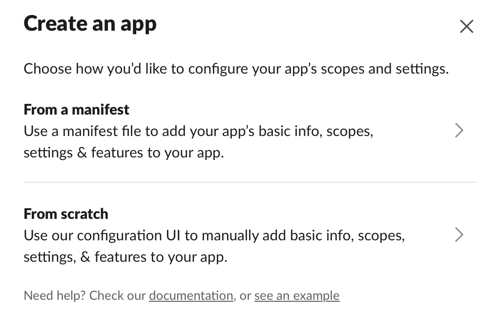

# slack-auto-status-rs
Slackのステータスを自動変更するRust製のスクリプト

---

1. Slack Appを作成
   
   URL: https://api.slack.com/apps
      
   作り方は `manifest`/`scratch` どちらでも良い

   
    
   `users.profile:write`権限を付与が必要

   [manifest.json](manifest.json)を使えば、`name`を変更してコピペするだけ

   参考：[User presence and status](https://api.slack.com/apis/presence-and-status)

2. リリースモードでビルド
   ```bash
   cargo build --release
   ```
   
3. [com.slackstatus.plist](com.slackstatus.plist)を編集
  - `ProgramArguments`のPathを上のリリースバイナリファイルのパスに変更
  - `SLACK_TOKEN`のTokenをSlack App > `OAuth & Permissions` > `User OAuth Token`に変更

4. プロパティリスト（LaunchAgent）をコピー
   ```bash
   cp com.slackstatus.plist ~/Library/LaunchAgents/
   ```

5. LaunchAgentの有効化
   ```bash
   launchctl load ~/Library/LaunchAgents/com.slackstatus.plist
   ```

   無効化したい場合は
   ```bash
   launchctl unload ~/Library/LaunchAgents/com.slackstatus.plist
   ```
